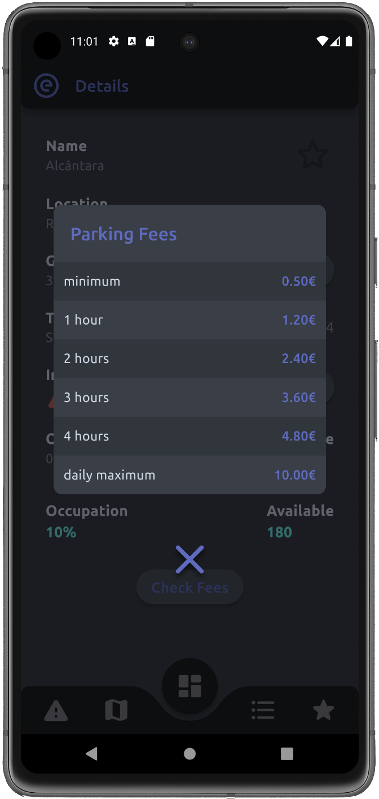

# E-Park | Mobile Parking App

A simple and intuitive mobile application designed to easily find and get real-time info about Emel parking lots.
Developed using Flutter for Android and IOS.

## Group Constitution

- a22107873 Valentim Paulo
- a22202130 Alexandre Marques

Expected grade (part 1) - 19 \
Expected grade (part 2) - 17.5

## Application Structure
The structure of the application was developed so that, everything stays in memory all the time in order to
improve speed and efficiency. To do this, we use a ***global state*** that implements the ***Observer-Observable*** pattern and stores all the information about the parking lots for the whole application.

In order to implement an **offline mode** we use a ***sqlite*** database, which contains all the parking lots' data, except
real-time data since this data becomes stale (outdated) in a very short time and for that reason we considered that it
was not worth storing.
We also pre-loaded the database with data about the parking lots to make sure the data stays accurate throughout the
whole application and load it into the *global state* as soon as the application is launched. We made this extra step because the API, many times, returns invalid and inaccurate data.

Then, for real-time data, we consumed the ***EMEL API***. The API is responsible for providing information about the
parking lots'
current free spots, as well as other data. Therefore, every minute we make a request to the API and update the information stored in the *global state*. 
We also accomodate cases where the API might contain information about
parking lots that are not already stored in the database. In that case, we add them to the *global state* like we do for
the other ones already in the database.

This arquitecture provides a set of advantages, as the application is ready to work in offline mode from the start (without ever needing to connect to the internet) since it already has most of the data pre-loaded in the database.

## Business Logic
### Global State (class)
**Fields**
- parkingLots - List\<ParkingLot>
- currentLocationLat - double?
- currentLocationLon - double?
- currentListSortingMethod - SortingMethod
- focusedParkingLot - ParkingLot
- lastUpdatedParkingInfo - DateTime
- parkingDataFetchTimer - Timer?
- deviceLocationFetchTimer - Timer?

**Methods**
- List\<ParkingLot> get parkingLots
- double? get currentLocationLat 
- double? get currentLocationLon
- SortingMethod get currentListSortingMethod
- ParkingLot get focusedParkingLot
- DateTime get lastUpdatedParkingInfo
- set currentListSortingMethod(SortingMethod sort)
- set focusedParkingLot(ParkingLot parkingLot)
- Future\<bool> loadInitialData()
- void _updateParkingDataPeriodically(Duration interval)
- void _getCurrentDeviceLocationPeriodically(Duration interval)
- Future\<void> updateParkingData()
- void invalidateParkingData()
- Future\<void> _updateLocationData()
- ParkingLot? getParkingLotById(String id)
- ParkingLot? getParkingLotByName(String parkName)
- ParkingLot? getParkingLotByCoordinates(String lat, String lon)
- bool compareDouble(double value1, double value2, int places)
- bool validParkingLotId(String id)
- List\<ParkingLot> getFavoriteParkingLots()
- bool locationIsEnabled()

### Park (class)
**Fields**
- id - String
- name - String
- address - String?
- coordinates - String
- schedule_working_days - String?
- schedule_weekends - String?
- typology - String
- parkingPlaces - int
- chargingPlaces - int?
- disabledPlaces - int?
- active - bool
- markedFavorite - bool
- fees Map\<String, double?>?
- occupiedPlaces - int?
- incidents - List\<Incident>

**Methods**
- int? get disabledPlaces
- int? get chargingPlaces
- int get parkingPlaces
- String get typology
- String? get scheduleWorkingDays
- String? get scheduleWeekends
- String get coordinates
- String? get address
- String get name
- String get id
- bool get active
- bool get favorite
- set setFavorite(bool value)
- set parkingPlaces(int value)
- set occupiedPlaces(int? value)
- set active(bool value)
- Map\<String, double?>? get fees
- int? get occupiedPlaces
- List\<Incident> get incidents
- set incidents(List\<Incident> value)
- void addIncident(Incident incident)
- void updateLiveData(ApiParkingLotData apiData)
- void invalidateLiveData()
- int? getAvailablePlaces()
- int? getOccupationPercentage()
- String getOccupationInText()
- String getWeekdaysSchedule()
- String getWeekendsSchedule()
- bool currentlyInServiceStatus(DateTime targetTime)
- List\<Incident> getIncidentsLast24Hours()
- List\<Incident> getIncidentsLastWeek()
- List\<Incident> getIncidentsLastWeekExceptLast24Hours()
- double? getDistanceToParkingLotInMeters()
- String? getDistanceToParkingLotInString()
- double getLatitude()
- double getLongitude()

### Incident (class)
**Fields**
- timestamp - DateTime
- description - String
- severity - IncidentSeverity
- image - String

**Methods**
- DateTime get timestamp
- String get description
- IncidentSeverity get severity
- String? get image

## Functionalities

| Functionality            | Description                                                                                                                                                                |
|-----------------|--------------------------------------------------------------------------------------------------------------------------------------------------------------------------------|
| Loading Screen  | Screen that loads the mobile application, automatically redirecting to the dashboard page.                                                                                     |
| Dashboard       | Screen that shows the 4 closest parks and 2 parks marked as favorite, chose by distance as well. Tapping on any park will redirect to the details page. |
| Parks Map       | Screen that shows a map and the parks in their location. Tapping on any park will open an info box wich contains park information and two buttons, the GPS one will give the directions to the park automatically and the INFO one will redirect to the details page.                                                                                                                                                                                      |
| Parks List      | Screen that shows a list of all the parks. The list can be ordered in different ways, by tapping the order button in the bottom right corner and choosing what type of order you want and tapping on any park will redirect to the details page.                                |
| Favorites       | Screen that shows a list of all the parks that were tagged as favorite. Clicking on any park will redirect to the details page.                                                |
| Details Page    | Screen that shows all the information of the park. The page has three buttons, the GPS one will give the directions to the park automatically, the INCIDENTS one will show the list of all the Incidents registered in that park and the FEES one will show the prices of the park. |
| Incident Report | Screen that contains a form. Having mandatory fields, after filling the form there will be made checks and if it is successfull, the Incident will be registered in that park. |
| Navigation      | The Navigation between screens is made using a bottom app bar. |
| Database      | The Database contains all the static information of the parks available in the mobile app and also contains all the incident that were submited in the incident report page. This incidents will be automatically associated with their respective park |
| Geolocation      | The Geolocation is used in the application, in order to know the user current location, if he allows to. By allowing the application will calcute the distance between the user and the parks and display that information on each park. |
| Offline Operation  | Since the database as all the static information, every time that the app is started the information will be used allowing the user to use the app without a connection to the internet. |

## App Pages (Screenshots)
### Splash Screen

### Dashboard

### Dashboard (search)

### List Mode

### List Mode (sorting filter)

### Map Mode

### Map Mode (parking popup)

### Details

### Details (incidents)

### Details (fees)

### Incident Report

### Favorites

## Demonstration Video
[https://youtu.be/YRzSNuL_ltM](https://youtu.be/YRzSNuL_ltM)

## Information Sources
- Chat GPT: [https://chatgpt.com/](https://chatgpt.com/)
- Google Maps markers from flutter widgets (blog): [https://medium.com/swlh/using-material-icons-as-custom-google-map-markers-in-flutter-3e854de22e2](https://medium.com/swlh/using-material-icons-as-custom-google-map-markers-in-flutter-3e854de22e2)
